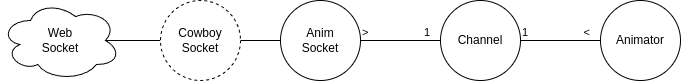
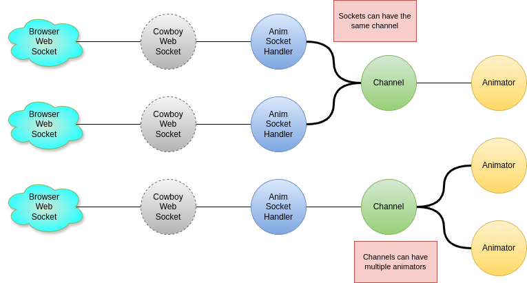
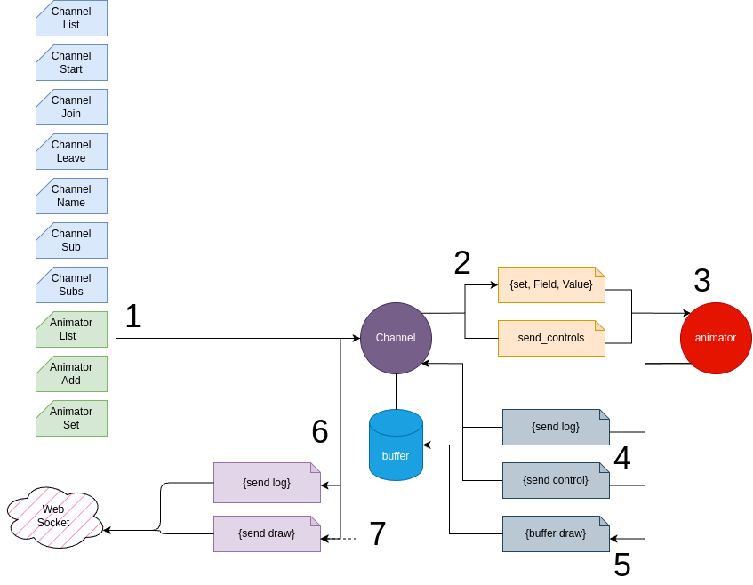
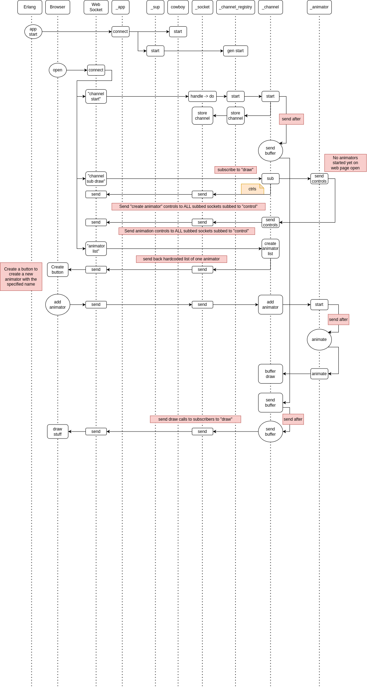

ws_animator
=====
An Erlang web server for animating in JS over a web socket.

Overview
-----
Web sockets connect to the Cowboy web server; Cowboy starts up our process to handle messages from the socket; our socket can connect to a "channel", which communicates with animator processes. Each socket can have one channel, but multiple sockets can have the same channel; each animator has one channel, but a channel can have multiple animators.

Example Setups
----

Protocol
-----
1. The websocket sends commands to our socket process (not shown) and, necessary, and if one exists, forwards them to the channel.
1. Channel forwards animation commands to the animator.
1. Animator animates
1. Animator sends log messages and web controls to Channel
1. Animator sends draw calls to Channel buffer
2. Channel sends messages (e.g. log, info) to the websocket
1. Channel sends buffered draw calls to websocket
 

Build
-----

    $ rebar3 compile

Run
-----

- Run Erlang shell
  - $ rebar shell
- Open web broswer
- Navigate to http://localhost:8081/
  - goes to index.html
  - webpage should open websocket automatically
  - look in dev console

Sequence Diagram
-----

