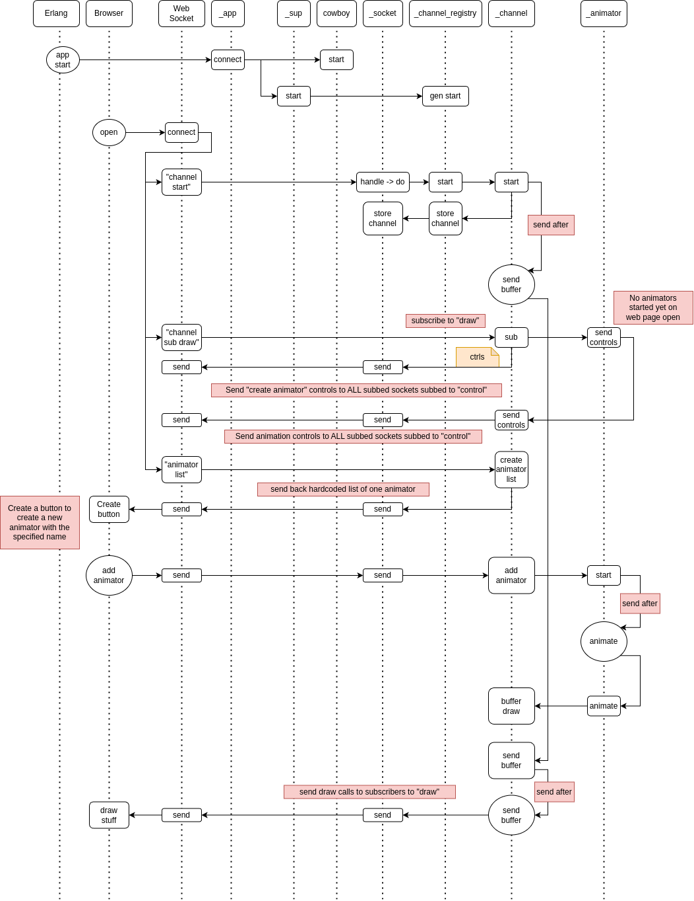

ws_animator - a hobby project
=====
**Warning**: I'm a backend developer with no experience in, or talent for, graphics. This is just so I can toy away with different procedural animation ideas, and builds on my previous projects, combining JavaScript canvas drawing with Erlang concurrency, and Cowboy web server websockets:
- (Snake game)[https://github.com/cwmaguire/snake_game]
- (JS Doodle)[https://github.com/cwmaguire/js_doodle]
- (Animation)[https://github.com/cwmaguire/animation]
- (Bezier)[https://github.com/cwmaguire/bezier]

Overview & Purpose
-----
An Erlang web server for animating in JS over a web socket. ws_animator allows for multiple websockets to subscribe to events from the same animation "channel". Each channel can run multiple animation processes running on different schedules. Currently, each websocket can only listen to one channel, but each channel can have multiple animators. Each animator only sends messages to one channel.

The channels buffer animation calls from the animators and send then all at once over the websocket allow with a prepended "clear" instruction to clear the canvas. It's up to the developer to ensure that animations don't double up; you could have the channel send animate messages, or you could line up the processes to fire at the same rate. (I'm sure there are lots of clever ways to achieve this, these are just two suggestions off the top of my head.)

It wouldn't take a lot to allow sockets to subscribe to multiple channels, or for multiple channels to listen to the same animator, or animators to send messages to multiple channels.

Architecture Overview
-----
Web sockets connect to the Cowboy web server; Cowboy starts up our process to handle messages from the socket; our socket can connect to a "channel", which communicates with animator processes. Each socket can have one channel, but multiple sockets can have the same channel; each animator has one channel, but a channel can have multiple animators.

Example Setups
----

Protocol
-----
1. The websocket sends commands to our socket process (not shown) and, if necessary, and if one exists, forwards them to the channel.
1. Channel forwards animation commands to the Animator.
1. Animator animates
1. Animator sends log messages and web controls to Channel
1. Animator sends draw calls to Channel buffer
2. Channel sends messages (e.g. log, info) to the websocket
1. Channel sends buffered draw calls to websocket
 

Build
-----

    $ rebar3 compile

Run
-----

- Run Erlang shell
  - $ rebar shell
- Open web broswer
- Navigate to http://localhost:8081/
  - goes to index.html
  - webpage should open websocket automatically
  - look in dev console
 
Add an Animator
-----
(Hint: copy an existing animator to get started.)
1. Add a new animator name to the list of animators in [channel](src/ws_anim_channel.erl) in the animator_names/0 function
2. Add a decoding for the new animator in [channel](src/ws_anim_channel.erl) in the decode_animator_add_spec/1 function which points to an animation module
3. Add an animation gen_server module matching the module name in the previous step
4. Specify input form controls that the web page should render to control the animation
5. Add set/3 functions to match controls and update the animation state
6. Add an animate function
7. Send {buffer, draw, <JSON>} to the channel that started the animation process as often as you'd like

Sequence Diagram
-----

