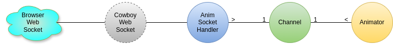

ws_animator
=====

An Erlang web server for animating in JS over a web socket.




```mermaid
flowchart TD
    W1[Websocket 1] & W2[Websocket 2] & W3[Websocket 3] <--> |Chan 1| CB[Cowboy]
    CB --- S1[Socket 1] & S2[Socket 2] & S3[Socket 3] --- Chan[Channel1]
    Chan --- Anim1[Animator 1] & Anim2[Animator 2]
    W3 -.-> |Sub draw| Chan

%% The ampersand just keeps you from having to repeat lines:
%% A --> B
%% A --> C
%% vs
%% A --> B & C
````

Build
-----

    $ rebar3 compile

Run
-----

- Run Erlang shell
  - $ rebar shell
- Open web broswer
- Navigate to http://localhost:8081/
  - goes to index.html
  - webpage should open websocket automatically
  - look in dev console
